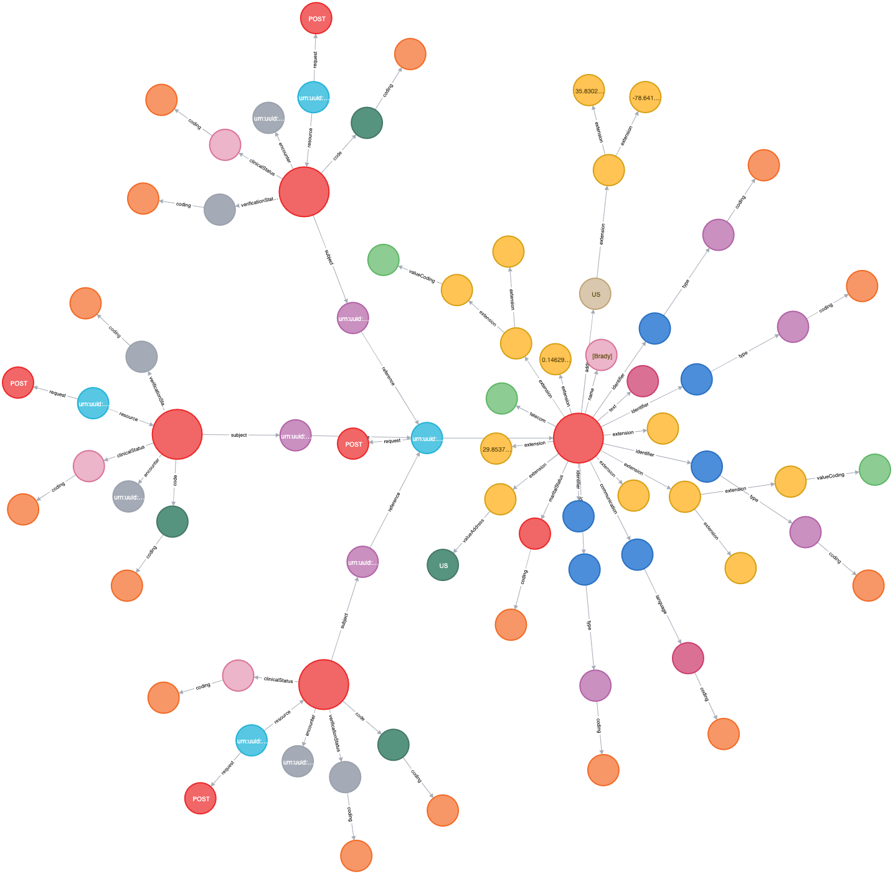

### Operationalizing Neo4j for use within Healthcare by leveraging HL7 FHIR Standards

#### Table of Contents

1.  [Introduction](#introduction)
2.  [Using CyFHIR](#usage)
3.  [Using This Codebase](#repo)
4.  [Performance Metrics](#performance)

* * *

<a name="introduction"></a>

# 1. Introduction

### Background

Before explaining CyFHIR, you should first understand what **[Neo4j](https://neo4j.com/developer/graph-database/#neo4j-overview)** and **[FHIR](https://www.hl7.org/fhir/overview.html#Background)** are, as this project is directly built off of them. To summarize, Neo4j is an 'open-source, NoSQL, native graph database', and FHIR is an open standard in healthcare maintained by HL7 who publishes interoperable methods of data transfer, storage, classification, and more. We highly recommend at least reading through HL7's FHIR documentation before continuing to work with CyFHIR.

### What is CyFHIR?

CyFHIR is a native Neo4j plugin that acts as the bridge between FHIR and Neo4j. With CyFHIR, users can: directly load FHIR Resources into their Neo4j database, execute Neo4j queries (using Neo4j's query language, **Cypher**) on those FHIR Resources, and return query responses as FHIR Resources that meet HL7's standards.

<a name="usage"></a>

# 2. Using CyFHIR

### Usage Prerequisites

-   Docker Desktop (docker and docker-compose)

### How to use CyFHIR

We recommend the use of Docker for running Neo4j version 4.2.x locally to maintain static development environments that can be easily cleaned/removed. But if you wish to use Neo4j Desktop, that should work as well. Whichever development you choose, adding CyFHIR to Neo4j should be the same process:

1.  Download the latest release from <https://github.com/Optum/CyFHIR/releases>
2.  Add CyFHIR to your `$NEO4J_HOME/plugins` folder
3.  Download the latest APOC Package from <https://github.com/neo4j-contrib/neo4j-apoc-procedures/releases> (APOC is a Neo4j community package with tons of useful procedures and functions and we use it in tandem with CyFHIR)
4.  Add APOC to your `$NEO4J_HOME/plugins` folder
5.  In `$NEO4J_HOME/conf/neo4j.conf` add apoc and cyfhir as unrestricted plugins `NEO4J_dbms_security_procedu res_unrestricted: apoc.*,cyfhir.*`
6.  Run Neo4j

### CyFHIR Commands

Currently CyFHIR has 3 procedure2 and 2 aggregating functions:

##### Procedures:

-   `cyfhir.bundle.load(String <FHIR JSON>, { validation: Boolean, version: String <FHIR Version: "DSTU3", "R5", "R5"> })`
    -   To load FHIR into Neo4J, you can easily do this by running `CALL cyfhir.bundle.load()` with the input being a FHIR Bundle JSON that has been formatted as a string (adding escape chars to all double quotes in the JSON).

    - Validation is turned off by default but if you want to validate FHIR resources as you load them, add the config map with validation: true and version: "DSTU3", "R4", or "R5". Validation is fast with a less than 5% reduction in loading speed.

    -   Another thing to note is if you want to test this way with generated data, we recommend [Synthea](https://github.com/synthetichealth/synthea). BUT if you choose to use Synthea, you must remove the generated html in every resource of the bundle for all entries. The path to the field to remove is: `Bundle.entry[i].resource.text.display`. This is necessary as there are escape chars hidden within the display that Neo4j cannot handle.


-   `cyfhir.resource.load(String <FHIR JSON>, { validation: Boolean, version: String <FHIR Version: "DSTU3", "R5", "R5"> })`
    -   To load FHIR into Neo4J, you can easily do this by running `CALL cyfhir.resource.load()` with the input being a FHIR Resource JSON that has been formatted as a string (adding escape chars to all double quotes in the JSON).

    - Validation is turned off by default but if you want to validate FHIR resources as you load them, add the config map with validation: true and version: "DSTU3", "R4", or "R5". Validation is fast with a less than 5% reduction in loading speed.

    -   Another thing to note is if you want to test this way with generated data, we recommend [Synthea](https://github.com/synthetichealth/synthea). BUT if you choose to use Synthea, you must remove the generated html in every resource of the bundle for all entries. The path to the field to remove is: `Resource.text.display`. This is necessary as there are escape chars hidden within the display that Neo4j cannot handle.


-   `cyfhir.resource.expand()`
    - Pass either a **Resource** node or an **Entry** node into `cyfhir.resource.expand()` to expand out the full resource/entry to be able to pass it into an aggregating function like `cyfhir.resource.format()` or `cyfhir.bundle.format()`

    - Example where "entry" is a previously queried node with label type "entry":
    ```js
    CALL cyfhir.resource.expand(entry) YIELD path
    RETURN cyfhir.bundle.format(collect(path))
    ```

##### Functions

-   `cyfhir.bundle.format()`
    -   Pass an array of expanded FHIR Resources as entries that were the result of some query. To properly pass data into this function, the last few lines of your query will probably end up looking like this:

      ```js
      UNWIND entryList AS entry
      CALL cyfhir.resource.expand(entry) YIELD path
      RETURN cyfhir.bundle.format(collect(path))
      ```

     The entryList variable above that gets unwound is the list of entry nodes that match a query that you've written above. This expands those entry nodes to get the full resource, converts that to a JSON/tree-like structure, then passes it to CyFHIR to build the bundle and enforce correct cardinality of resource properties.

- `cyfhir.resource.format()`
    - Just like `cyfhir.bundle.format()`, this function will format a fully expanded resource, but only one. As part of some query to find a single Resource, you pass the **Resource** node into the expander,then pass the collected paths into the formatter to build your FHIR Resource.

    ```js
    CALL cyfhir.resource.expand(resource) YIELD path
    RETURN cyfhir.resource.format(collect(path))
    ```

<a name="repo"></a>

# 3. Using this Codebase

Understanding the Cypher and code behind this solution is not trivial, so we recommend using this repo to get a better understanding of how this all works.

In this repo we have:

-   The CyFHIR Java Project
-   An Express.js HTTP Server that also serves Swagger Docs for interacting with Neo4j, used for demonstrating examples of CyFHIR in action
    -   Check out the CyFHIR Controller in [express/src/controllers/cypherController.js](./express/src/controllers/cypherController.js) for some Cypher examples using CyFHIR, we are going to cook up a recipe book in the future
-   Docker-Compose files for spinning up Neo4j, Node.js, and a small ELK Stack with APM for performance monitoring if you are interested in that

Just be sure to `git clone` this repo and `cd CyFHIR` into the project

### Starting Neo4j with CyFHIR in Docker and local Express.js server

1.  In one terminal window run command `make neo4j`
2.  In a different terminal window run command `cd express && npm ci`
3.  Then run `npm run serve` to start the Express.js server
4.  Open browser to <http://localhost:7474> and <http://localhost:3000/docs>
5.  Use Swagger Docs to Load Test Bundle or run `bash bin/seed.sh` from root of project to seed Neo4j with 6, large Synthea Bundles

### Starting Neo4j with CyFHIR and Express.js server in Docker

1.  In terminal run command `make backend`
2.  Open browser to <http://localhost:7474> and <http://localhost:3000/docs>
3.  Use Swagger Docs to Load Test Bundle or run `bash bin/seed.sh` from root of project to seed Neo4j with 6, large Synthea Bundles


### Visual Graph of Patient and Conditions


